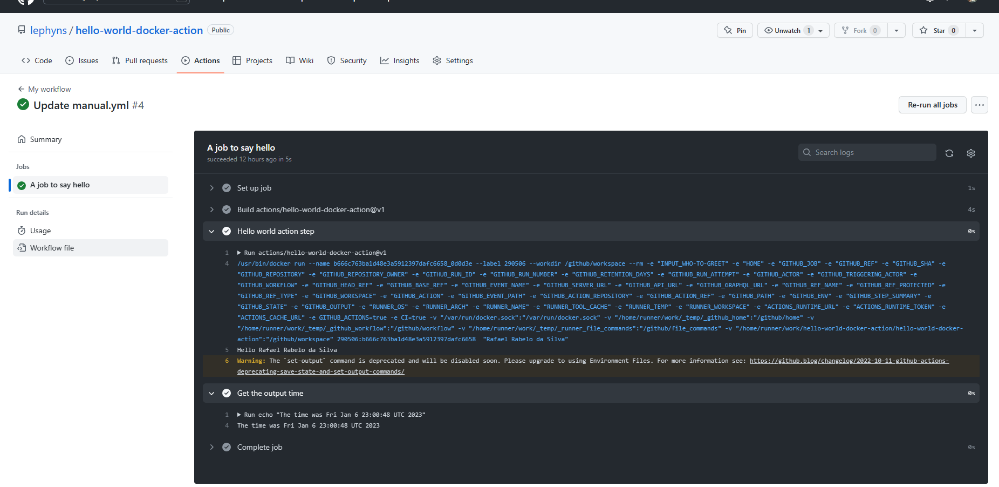

# O projeto

Este projeto Docker imprime a frase "Hello" + o nome de uma pessoa para saudar no log e exibe o momento exato que a saudação foi realizada. 
Abaixo print do job:

# Os arquivos

* Criado arquivo `Dockerfile` onde foi declarado os recursos necessários para que a aplicação rodasse corretamente (container, imagem e localização do código).
* Criado arquivo `action.yml` de metadados de ação os quais definem um **parâmetro de entrada** who-to-greet (quem cumprimentar) e um **parâmetro de saída** time (hora) que refere-se ao momento exato que a saudação foi realizada. 
* Criado arquivo `entrypoint.sh` (shell) que usa a variável de entrada `who-to-greet` para imprimir `Hello [who-to-greet]` no arquivo de log. Este mesmo script obtém a hora e define a mesma como variável de saída a qual poderá ser usada posteriormente para as ações executadas. 
Para que o GitHub pudesse reconhecer as variáveis de saída, foi necessário usar um comando de fluxo de trabalho em uma sintaxe específica: 
    `echo "::set-output name=<output name>::<value>"`

# Dicas

* Para que o arquivo ` entrypoint.sh` se tornasse executável é necessário utilizar o comando abaixo no terminal: 
    `chmod +x entrypoint.sh`

* Se você quiser adicionar uma tag de versão a cada commit realizado basta digitar o comando abaixo no terminal: 
    `git tag -a -m "My first action release" v1` 
    `git push --follow-tags`